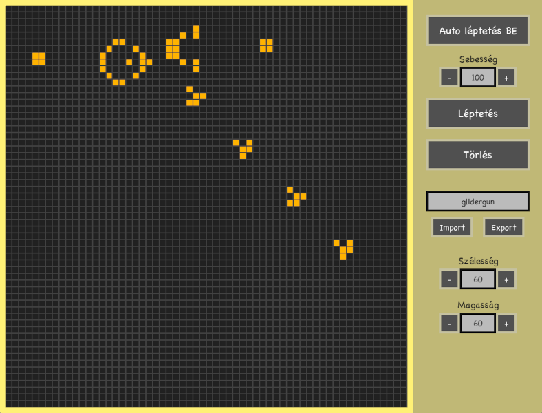

# Életjáték (Game of Life)

## A játék leírása
A program a Conway-féle életjátékot valósítja meg grafikus, menüvezérelt formában. A
játéktér egy kétdimenziós négyzetháló, melyben egy-egy cella lehet élő, vagy halott. A játék
egyetlen kezdeti állapotot („seed”) igényel és a következő állapot mindig kiszámolható a
jelenlegi állapotból. A játéknak végtelen állapota létezik.

A kiszámítás abból áll, hogy cellánként meg kell vizsgálni az adott cella 8 szomszédos celláját,
és szabályok alapján eldönteni, az adott cella milyen állapotot fog felvenni a következő
lépésben. Ha a pálya szélén helyezkedik el a cella, akkor a pálya túlsó szélén levő cellák a
szomszédok, ezt úgy kell elképzelni, mintha egy gömb felülete lenne síkra kiterítve.

Az egyes cellák következő állapotának megállapítása az alábbi szabályok szerint történik:
- Az élő cella meghal, ha kevesebb, mint 2 élő szomszédja van. (népességcsökkenés)
- Az élő cella életben marad, ha 2 vagy 3 élő szomszédja van.
- Az élő cella meghal, ha több, mint 3 élő szomszédja van. (túlnépesedés)
- A halott cella, ha pontosan 3 élő szomszédja van, élővé válik. (szaporodás)

## A program használata

A program indításakor megjelenik maga a játéktér. Itt bal klikkel lehet cellákat élőre rajzolni,
és jobb klikkel halottra. Ha a felhasználó nyomva tartja az egeret, akkor folyamatosan rajzol.
A program további vezérlése az ablak jobb oldalán található vezérlőgombokkal történik.

## A vezérlőgombok

### Auto léptetés BE/KI
Az automatikus léptetést kapcsolja be vagy ki. Automatikus léptetés közben a beállított
szimuláció sebességgel folyamatosan megjelenik a játéktér következő állapota. Automatikus
léptetés közben semmilyen más művelet nem végezhető, kivéve a sebesség állítását.

### Sebesség állítása
A ’+’ illetve ’-’ gombokkal, vagy kézzel beírva lehet állítani az automatikus léptetés sebességét. Felső határa 1000
lépés/másodperc, alsó határa 1 lépés/másodperc. A sebesség alapértelmezett értéke 10
lépés/másodperc.

### Léptetés
Kézi léptetés, a játékteret a következő állapotra lépteti. Nem működik, ha épp fut az
automatikus léptetés.

### Törlés
Törli a játéktér celláit (az összes cellát halottra állítja). Nem működik, ha épp fut az
automatikus léptetés.

### Export
A jelenlegi játékállapotot kiírja a megadott nevű fájlba, melyet aztán be lehet importálni. Nem
működik, ha épp fut az automatikus léptetés.

### Import
A megadott nevű fájlban levő játékállapotot importálja, felülírva azzal a pályán jelenleg levő cellák
állapotát. Nem működik, ha épp fut az automatikus léptetés.
Ha a fájl nem létezik, nem változik a játéktér. Ha a fájlban szereplő játéktér mérete nem fedi
le a teljes játékteret, akkor a le nem fedett területen a cellák halottra lesznek állítva. Ha a
fájlban szereplő játéktér mérete túllóg a jelenlegi játéktér méretén, a felhasználónak kell
észlelnie, hogy az importált állapot egy része hiányzik, megnövelni a pálya méretét, majd újra
importálni a fájlt.

### Játéktér átméretezése
Az oszlopok és a sorok számát lehet állítani a megfelelő ’+’ illetve ’-’ gombok használatával, vagy az érték kézi beírásával.
Nem működik, ha épp fut az automatikus léptetés.